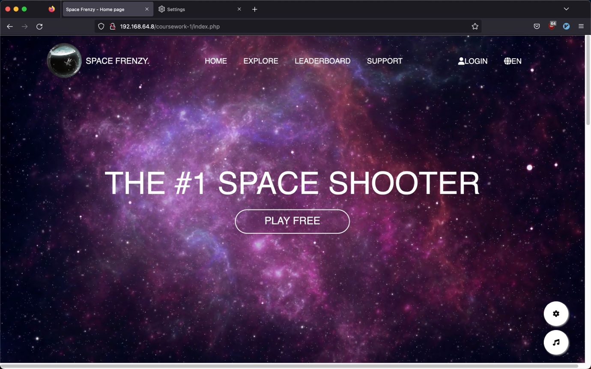
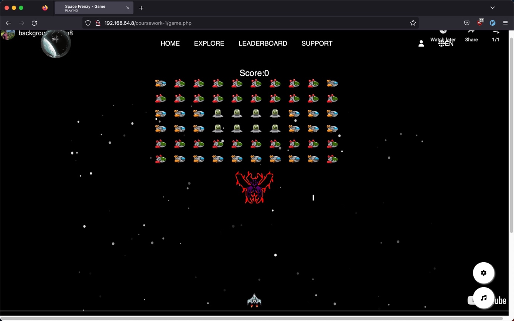

# Space Frenzy

Space Frenzy is a recreation of tw0 popular arcade games from the 1900s, Space Invaders and Space Shooters. This implementation utilizes `HTML5`, `CSS`, `PHP` and `Vanilla Javascript` to deliver an exciting gaming experience. In this game, the player control a spaceship and engages in battles against waves of aliens, including a challenging boss enemy in space.

This website has been developed on `Ubuntu 20.04`.





## Installation

1. Clone the repository to your local machine.

   ```bash
   git clone https://github.com/derecklhw/space_frenzy_game_website.git
   ```
   
3. Install `Apache2` as web server and `PHP` on your machine by running the following command.

    ```bash
    sudo apt update
    sudo apt install apache2
    sudo apt install php libapache2-mod-php
    ```

4. Start the Apache web server by running

    ```bash
    sudo systemctl start apache2
    ```

5. Move the cloned project directory to the Apache document root. For example, if the document root is `/var/www/html`, you can use the following command:

    ```bash
    sudo mv space_frenzy_game_website /var/www/html
    ```

6. Adjust the firewall to allow Web traffic

    ```bash
    sudo ufw app list
    sudo ufw allow in "Apache"
    ```

    Note: `Apache` profile opens only port 80 (normal, unencrypted web traffic). Since we haven’t configured SSL for our server yet, we will only need to allow traffic on port 80.
    
    Verify the change by typing and the output will provide a list of allowed traffic.

    ```bash
    sudo ufw status
    ```

7. If you don't know your server's IP address, use below command

    ```bash
    hostman -I
    ```

When you have your server’s IP address, enter it into your browser’s address bar

## Pages

| Page                 | Description                                                                                  |
| -------------------- | -------------------------------------------------------------------------------------------- |
| Home                 | Introduction of the webpage options.                                                         |
| Game                 | Choose the desired game mode and play it.                                                    |
| Explore              | Provides an overview of the different game modes and a tutorial on how to play.              |
| Leaderboard          | Displays a sorted table in descending order, showing the highest scoring players at the top. |
| Login & Registration | Allows users to log in or register to access the game.                                       |
| Support              | Enables registered users to change their current password to a new one.                      |

## Things Learned and Implemented

### Front-end Development

- Utilized `HTML5` and `CSS` to create a visually appealing and responsive user interface.
- Implemented `Vanilla JavaScript` to enhance interactivity and user experience.
- Applied modern design principles to improve the overall aesthetics of the game.

### Back-end Development

- Utilized `PHP` for server-side scripting and handling data.
- Implemented `session management` for user authentication and authorization.
- Integrated `local storage` and `session storage` to store and retrieve game data.

## Conclusion

Thank you for considering Space Frenzy! We hope you enjoy playing the game and experience the nostalgic thrill of the classic arcade era. If you have any questions or feedback, please don't hesitate to reach out. Happy gaming!
